 

<h1 data-importer="text" align="left">
  👋 Hi there, Welcome to my GitHub profile
</h1>

###

  My name is Henrique and I'm a JavaScript Developer and Student, from Minas Gerais, Brazil.

###

<h1 data-importer="text" align="left">About Me</h1>

###

  - Systems Development Technician 
  - Back-end Developer 
  - Node.js 
  - PostgreSQL 
  - REST API Development 
  - Database Integration

###

<h2 data-importer="text" align="left">Techs</h2>

###

  
  

  
  

  
  

  
  

  
  

  
  

  
  

  

###

 

  

  

  

###

###

<h2 data-importer="text" align="left">Contact</h2>

###

  

  

  

###
